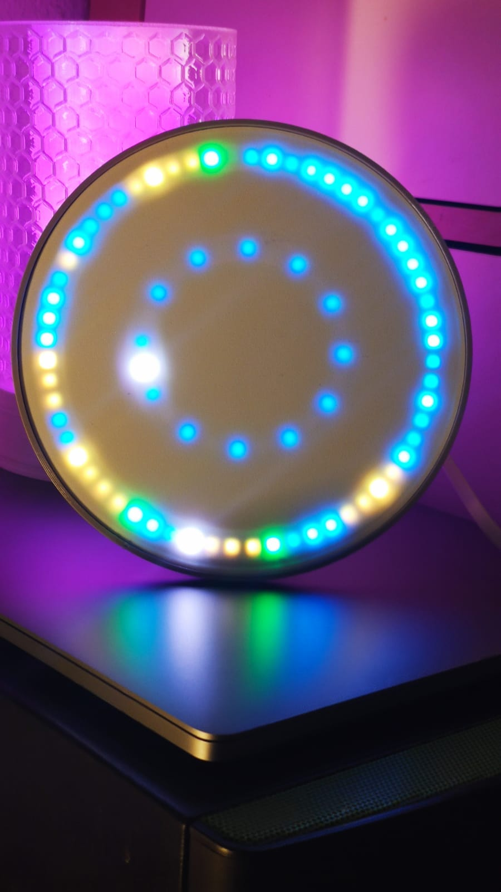
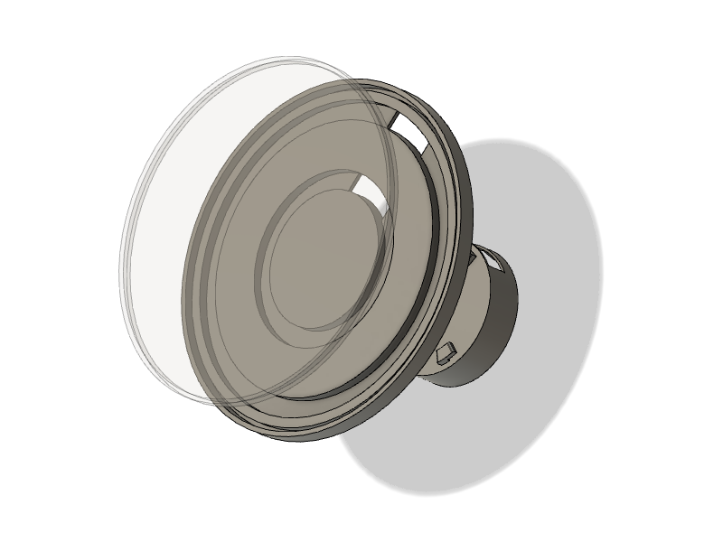

# DCF77 LED Clock

A visualization for the DCF77 signal using 2 WS2812 / Neopixel LED Rings (60 and 24 LEDs). The DCF77 Signal is received via a Websocket Stream.

The intention is *not* to simple show the current time, but to show the single (bit) signals of the DCF77 signal.

Find more Information about DCF77 at Wikipedia: https://en.wikipedia.org/wiki/DCF77

## Visualization

In the picture below the time is 21:33. The 'white' pixels show the current time in the style of an analog clock: Minutes are at 33 and the hours are between 8 and 9 - like the clock-indicator of an analog watch.

Every "Block" is shown in alternating colors (yellow / blue). E.g. the first yellow block is the one-block of minutes (here 0100 = 4, means after the full circle the next one part of minute is 4).

There are 3 bits that are used as parity bits (green pixels in the image).

The second is indicated with a slightly lighter / darker pixel that's moving (hard to see in a still image).

### Limitations

This implementation does *not* always show the correct time:
- the 'white' indicators are only refreshed after a full circle (as intended by dcf77 protocol), but only if the parity bits are correct.
- if a partity bit is wrong, the indications 'lags' behind the real time
- due the source is a websocket... wrong data is really rare ;)
- if the websocket connection is interrupted: you'll be timeless. grap yourself a coffee and relax ;)

## Hardware

### 3D Print

Find the STL Files in the [3D-Parts](./3d-parts) Folder. 

- Printed with a Prusa MK3S+ with PETG Filament
- The "Shader" is printed with white PETG

### LEDs

There are multiple shops that deliver WS2812/Neopixel Rings (to Germany). Here is a short, uncomplete list. Just search for 'ws2812 ring' and you find a bunch of suppliers ;)

Solder the LED Rings together in a 'chain':
- LED 0-59 (the "minute" ring)
- LED 60-83 (the "hour" ring)

Data OUT of the large ring must be connected to Data IN of the small ring. Connect the Data IN Pin of the large ring to the ESP (default: D4) and the GNC/VCC accordingly.

#### 60 LED Ring

- https://www.funduinoshop.com/WS2812-LEDs-mit-60-Pixeln
- https://www.berrybase.de/sensoren-module/led/ws2812-13-neopixel/ringe/neopixel-ring-mit-60-ws2812-5050-rgb-leds
- https://de.aliexpress.com/w/wholesale-ws2812-ring-60.html

*Watch out! Some sellers offer only 1/4th of the Ring! So read the descriptions with care.*

#### 24 LED Ring

- https://www.funduinoshop.com/epages/78096195.sf/de_DE/?ObjectPath=/Shops/78096195/Products/F-5-3
- https://www.berrybase.de/sensoren-module/led/ws2812-13-neopixel/ringe/neopixel-ring-mit-24-ws2812-5050-rgb-leds?c=2428

## Software

### Setup

1. Rename the `credentials_example.h` in the root folder to `credentials.h` and set your WiFi credentials.
2. Set the LED_PIN if you use a different PIN than D4
3. Run with PlatformIO.

### Used Libraries / Tools

- PlatformIO http://platformio.org/
- FastLED: https://github.com/FastLED/FastLED
- WebSocket for Arduino: https://github.com/Links2004/arduinoWebSockets
- ArduinoJson: https://arduinojson.org/